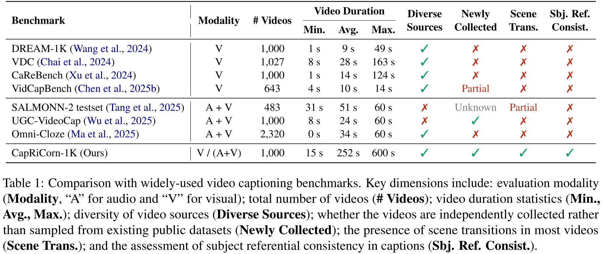
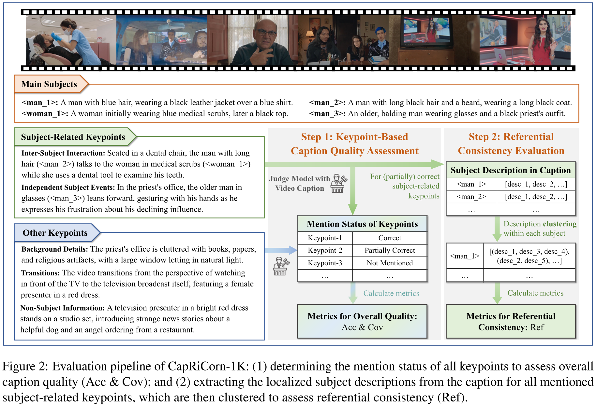
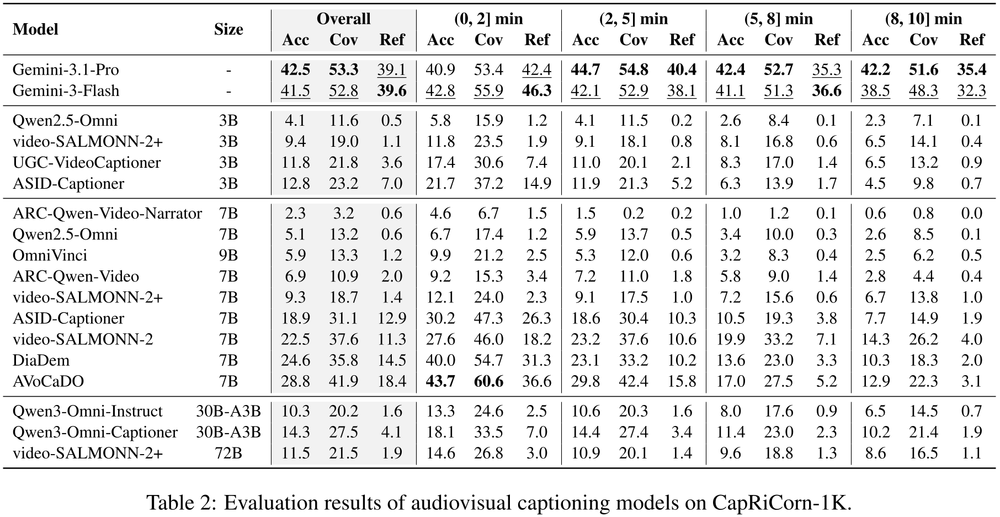
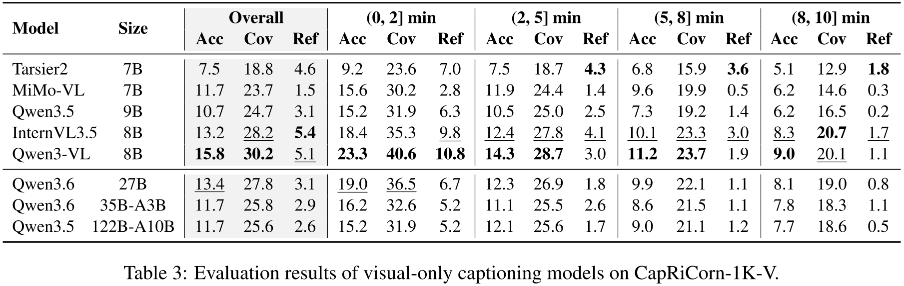

#  CapRiCorn-1K: A Comprehensive Benchmark for Video Captioning and Subject Referential Consistency Across Temporal Scales

<p align="left">
  <a href="https://arxiv.org/abs/2606.todo"></a>
  <a href="https://huggingface.co/datasets/XinlongChen/CapRiCorn-1K"></a>
</p>


## 🎯 Overview

**CapRiCorn-1K** is the first benchmark dedicated to evaluating both **video captioning quality** and **subject referential consistency** across long temporal horizons and diverse scenarios.

Unlike existing benchmarks that mainly focus on short videos and overall caption quality, CapRiCorn-1K contains **1,000 manually collected videos spanning 15 seconds to 10 minutes**, with rich scene transitions and recurring subjects. Besides evaluating caption accuracy and coverage, CapRiCorn-1K introduces a novel metric to assess whether the same subject is referred to consistently throughout the caption.

To support different captioning settings, CapRiCorn-1K provides:

- **CapRiCorn-1K**: audiovisual video caption evaluation (default).
- **CapRiCorn-1K-V**: visual-only video caption evaluation.

Extensive experiments show that current models struggle to maintain accurate descriptions and consistent subject references over long videos. Notably, the metrics on CapRiCorn-1K strongly correlate with downstream performance in both understanding and video generation tasks, validating its effectiveness as a proxy for real-world capabilities.


## ✨ Key Features

- 🎬 **Long-Horizon Videos**: 1,000 manually collected videos ranging from 15 s to 10 min (average 252 s).
- 🌍 **Diverse Scenarios**: Uniformly distributed across 8 major domains and 36 fine-grained subcategories.
- 🔄 **Rich Scene Transitions**: Every video contains at least one scene transition (average of 3.1 per video). Around 40% of videos involve subject clothing changes, making identity tracking highly challenging.
- 📝 **Fine-Grained Annotation**: Each video is manually labeled with an average of 4.4 subjects, 21.5 salient subject-related keypoints, and 14.9 other keypoints.
- 🔗 **Strong Downstream Correlation**: Evaluation metrics are proven to be highly correlated with downstream applications, accurately reflecting real-world utility.
- 🛡️ **Robust Evaluation Protocol**: The evaluation framework demonstrates high consistency and robustness across different judge models (e.g., closed-source GPT-4.1 and open-source Qwen3-235B-A22B-Instruct).




## 📏 Evaluation Metrics

CapRiCorn-1K utilizes an LLM judge (GPT-4.1 by default) to evaluate captions from two complementary perspectives based on manually annotated keypoints:

### Overall Caption Quality

The judge model determines the mention status of every keypoint as: (a) Correctly mentioned; (b) Partially mentioned or mentioned with errors; (c) Not mentioned. We compute:

- **Acc** (Accuracy): Percentage of correctly mentioned keypoints.
- **Cov** (Coverage): Percentage of correctly or partially mentioned keypoints.

### Subject Referential Consistency

For each mentioned subject, the judge model extracts all localized descriptions corresponding to that subject and performs co-reference clustering based on the caption context.

- **Ref** (Referential Consistency): Derived using a Rand Index-inspired approach. Measures how consistently the same subject is referred to throughout the caption. Higher Ref scores indicate better identity preservation and fewer ambiguous references.

<div align="center">  </div>


## 🏆 Model Performance

### Audiovisual Setting (CapRiCorn-1K)


### Visual-Only Setting (CapRiCorn-1K-V)


### 💡 Key Takeaways
1. **Performance Gap & Long-Video Robustness**: Closed-source models (Gemini-3.1-Pro/Flash) consistently outperform open-source models by a large margin. As video duration increases (e.g., > 5 mins), the performance of open-source models degrades significantly, particularly in subject referential consistency.
2. **Common Failure Modes**: Error analysis reveals that current models primarily fail in three scenarios: 
  - **Clothing Changes**: Failing to track a subject when their outfit changes or failing to explicitly articulate the transition.
  - **Multiple Subjects**: Confusing referential relationships among subjects with similar visual appearances or attributes.
  - **Multiple Scenes**: Resorting to ambiguous references when stable positional cues are lost after a camera transition.
3. **Resolution vs. Frame Count**: Ablation studies show that when constrained by context window limits, maintaining a sufficiently high resolution and then maximizing the frame count yields the most beneficial captioning performance.

---

## 🚀 Quick Start
Before using CapRiCorn-1K, please carefully read and agree to the following license terms.

### 📜 License

CapRiCorn-1K is released under the CC-BY-NC-ND-4.0 license.

> ⚠️ **Important Notice**<br>
> CapRiCorn-1K is intended **for research purposes only** and must not be used for any commercial or other non-research purposes. Users assume full responsibility for any consequences arising from unauthorized use or redistribution.
>
> We do not claim copyright ownership of any raw video files. Video access is provided to researchers under the condition of compliance with the above license. We fully respect and acknowledge the copyrights of the original video creators.
>
> If the original authors request removal of any videos, please contact us by [email](chenxinlong2025@ia.ac.cn) or submit an issue.

Once you have agreed to the license terms, follow the steps below to evaluate your video captioning models:

### 1. Download and Prepare CapRiCorn-1K
Obtain videos and annotations from [HuggingFace](https://huggingface.co/datasets/XinlongChen/CapRiCorn-1K), then place them under the repository `data/` directory.
```bash
cd CapRiCorn-1K
mkdir -p data
huggingface-cli download XinlongChen/CapRiCorn-1K --repo-type dataset --local-dir data
unzip data/videos.zip -d ./
```

### 2. Prepare Your Model Predictions
Save the captions generated by your model in a `.jsonl` file, where each line is a JSON object with the following format:
```json
{"video_id": "0001", "caption": "the model-generated video caption"}
```


### 3. Run Evaluation
The evaluation uses an OpenAI-compatible judge API. Pass the judge model with `--model`; optionally pass `--api-key`, `--base-url`, and concurrency or retry settings after the output directory.

For the audiovisual video captions:
```bash
bash 0_run_evaluation_on_CapRiCorn-1K.sh \
    /path/to/predictions.jsonl \
    /path/to/output_dir \
    --model gpt-4.1 \
    --api-key "$OPENAI_API_KEY"
```

For the visual-only video captions:
```bash
bash 0_run_evaluation_on_CapRiCorn-1K-V.sh \
    /path/to/predictions.jsonl \
    /path/to/output_dir \
    --model gpt-4.1 \
    --api-key "$OPENAI_API_KEY"
```

The output directory will contain intermediate judgements and final metric files:
- `1_accuracy_coverage_metrics.json`
- `2_referential_consistency_metrics.json`

*Note: You can resume an interrupted run with the same command and output directory; completed video IDs are skipped automatically.*

---

## 🖊️ Citation

If you find CapRiCorn-1K helpful for your research, please consider giving this repo a star ⭐ and citing our paper. We appreciate your support!

```bibtex
TODO
```
